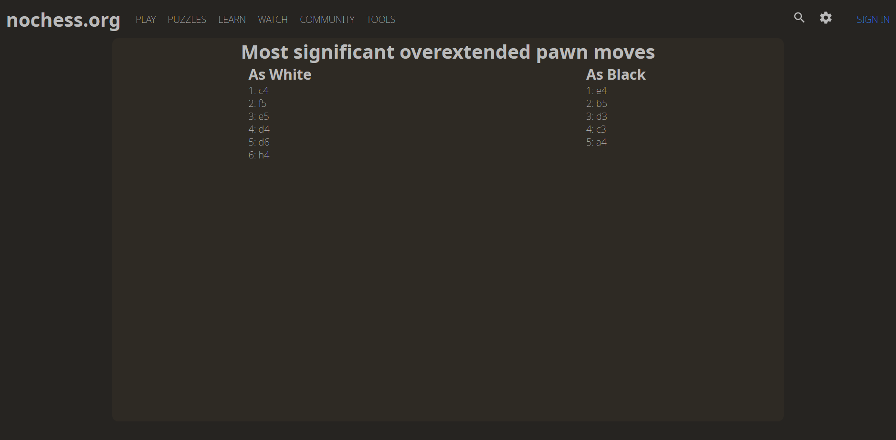

# chess-move-analysis

## Description

This project applies simple data analysis of chess games of a specified user on lichess. From these games, pawn moves are extracted and a simple logistic regression is run to find the significant pawn moves for the outcome of the game. Moves that could be considered overextension or pawn moves that oftentimes lead to bad outcomes. The idea here is that the person could and should consider whether or not these moves actually are negative or not, the model is very simple and should be taken with a grain of salt. It is more of a tool to make the person consider these moves more carefully after looking over their own games, not a finished analysis tool to be trusted.

## Usage

By changing the username at the bottom of the analysis.py file you can specify the username for which the analysis is run. Other things can be specified such as the function that does the analysis and what is the type of the game, e.g. blitz or bullet. Currently doing so changes the JSON files, but does not automatically affect the JS or HTML files.

## Layout

Deployment: [here](https://juhalo.github.io/chess-move-analysis/)

The general look is below:

## Credits

The project uses ZackClements client called [berserk](https://github.com/ZackClements/berserk) for the lichess API. This is used to get the games from the API.

The layout of the project copies the layout of [lichess](https://lichess.org) since it is meant as a light project for analyzing pawn pushes in a lichess user's games.
